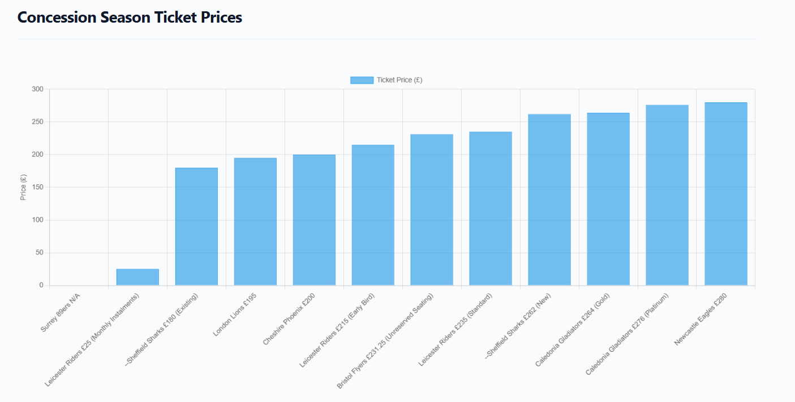

# Sheffield Sharks Seasonal Ticket Analysis
To conduct this analysis, I compiled season ticket pricing data across all Super League Basketball clubs, covering adult, concession, and child categories. This required reviewing official ticketing pages, comparing multiple seating tiers, and verifying ambiguous or inconsistent information where necessary. Season ticket structures vary far more than standard matchday pricing, with clubs offering loyalty discounts, premium seating packages, family‑oriented pricing, and in one notable case an installment‑based payment option. These variations required careful interpretation to ensure that each club’s offering was compared on fair and consistent terms.

The dataset used in this report captures season ticket prices across three groups: adults, concessions, and children. The aim is not simply to list prices, but to contextualise where the Sheffield Sharks sit within the broader market. By examining pricing clusters, loyalty incentives, and the spread between entry‑level and premium packages, this analysis highlights how the Sharks position themselves relative to budget clubs, mid‑tier competitors, and high‑end premium teams. It also identifies unique pricing strategies within the league, such as the Riders’ monthly installment model, and evaluates how such innovations could inform future pricing decisions for the Sharks.
 
 

- Overall Pricing Landscape
The dataset contains 14 adult season ticket prices across the Super League Basketball, ranging from low‑cost installment plans to high‑tier premium packages. This wide spread reflects a league with diverse pricing strategies, where clubs position themselves differently based on market size, fan demand, and the value of their seating tiers.

- Unique Installment Option (£34)
The £34 Leicester Riders monthly installment is a unique pricing feature within the league. It is not a full season price and instead represents a payment plan designed to increase accessibility. No other club currently offers a comparable structure.
This approach lowers the barrier to entry, attracts younger fans, students, and families, smooths revenue across the season, and reduces the psychological impact of a large upfront cost.
For the Sheffield Sharks, this is a feature that could realistically be adopted. It would increase affordability, align with modern subscription style pricing, potentially boost season ticket uptake, and position the club as fan friendly and financially flexible. Although the £34 value is not comparable to full‑season prices, it is analytically important because it highlights an innovation in pricing strategy.

- Price Distribution (Full Dataset)
The prices span from £34 to £369, giving a total spread of £335. This spread is inflated by the installment plan.
When focusing on full season prices only, the lowest price is £200 and the highest is £369, giving a spread of £169. This highlights a large premium gap between standard and high‑end seating.

- Sheffield Sharks Positioning
The Sharks offer two season ticket prices: £200 for existing season ticket holders and £288 for new season ticket holders.
This shows that the Sharks reward loyalty with a significant discount. New buyer pricing sits in the mid‑range cluster of the league. The Sharks are competitively priced without undercutting the market and avoid both extremes, being neither the cheapest nor the most expensive. Overall, the Sharks position themselves as a balanced, accessible, mid‑market club.

- Pricing Clusters
The mid‑tier cluster, which represents the core pricing zone of the league, sits between £280 and £305. This includes Cheshire Phoenix (£280), Manchester Giants (£285), Sheffield Sharks – New (£288), Newcastle Eagles (£290), Leicester Riders – Early Bird (£295), London Lions (£295), and Surrey Scorchers – Standard (£305). The Sharks sit directly within this cluster, signalling alignment with league norms.
The premium cluster consists of Caledonia Gladiators – Gold (£330), Caledonia Gladiators – Platinum (£345), Surrey Scorchers – Premium (£369), and Surrey Scorchers – Pod (£369). These represent high‑value, high‑cost seating tiers.

- What This Shows About the League
Pricing across the league is tiered rather than uniform. Installment plans are rare but strategically powerful. The Sharks are competitively priced and centrally positioned. The league has a clear mid‑tier cluster and a premium cluster. Surrey and Caledonia dominate the high‑end market, while the Riders innovate with affordability through installments.

- Summary Insight
The £34 installment option is not a statistical outlier to be dismissed; it is a strategic innovation. It highlights a pricing model the Sharks could adopt to increase accessibility and season ticket uptake. Meanwhile, the Sharks’ actual prices place them firmly within the league’s competitive mid‑range, offering solid value without undercutting the market.

 
 

- Overall Pricing Landscape
Concession season ticket pricing across the Super League Basketball shows a wide spectrum of approaches, with clubs balancing affordability against the value of their seating and the needs of concession‑eligible supporters. The range spans from highly accessible installment‑based options to more premium‑priced packages, reflecting each club’s interpretation of what concession pricing should achieve. Compared to adult tickets, the emphasis here leans more heavily toward inclusivity and reducing financial barriers for students, seniors, and other discounted groups.

- Unique Installment Option (£25)
The Leicester Riders’ £25 monthly installment stands out as the only subscription‑style concession option in the league. Rather than representing a full season cost, it spreads payments across the year, making season tickets more manageable for supporters with tighter budgets. No other club adopts this model, giving the Riders a distinctive position in the market. For the Sheffield Sharks, a similar approach could broaden accessibility, appeal to younger fans, and modernise the club’s pricing strategy. While the £25 figure cannot be directly compared to full‑season prices, it highlights a meaningful shift toward flexible, low‑commitment ticketing.

- Price Distribution (Full Dataset)
Concession prices range from £25 to £280, creating a total spread of £255. This range is widened by the installment plan, which sits far below traditional season ticket prices. When focusing solely on full‑season tickets, the range tightens significantly: the lowest price is £180 and the highest is £280, giving a spread of £100. This narrower distribution suggests that clubs aim to keep concession pricing relatively consistent and accessible, even when offering premium seating options.

- Sheffield Sharks Positioning
The Sheffield Sharks offer two concession prices: £180 for returning season ticket holders and £262 for new buyers. The loyalty discount places the Sharks among the more affordable options for existing supporters, reinforcing a commitment to retaining long‑term fans. The £262 new‑buyer price positions the club in the upper mid‑range of the league, competitive with teams offering enhanced seating or premium experiences. This dual‑tier structure allows the Sharks to remain accessible while still aligning with broader market expectations.

- Pricing Clusters
A clear mid‑tier cluster emerges between £200 and £264, forming the central pricing zone of the concession market. This group includes Cheshire Phoenix (£200), Leicester Riders – Early Bird (£215), Bristol Flyers (£231.25), Leicester Riders – Standard (£235), Sheffield Sharks – New (£262), and Caledonia Gladiators – Gold (£264). The Sharks sit firmly within this cluster, indicating strong alignment with league norms. Above this range, Caledonia Gladiators – Platinum (£276) and Newcastle Eagles (£280) represent the premium end of concession pricing. Surrey Scorchers’ absence of a concession category highlights the inconsistency in how clubs define and implement discounted ticketing.

- A Notable Anomaly: Bristol Flyers’ Use of Pence
One unusual feature in the dataset is the Bristol Flyers’ concession price of £231.25. It is the only value in the entire league that includes pence rather than a whole‑pound figure. This suggests a percentage‑based discount or a mathematically derived reduction from a base price rather than a manually set round number. Its presence stands out visually and statistically, making it an interesting deviation from the league’s otherwise uniform pricing style.

- What This Shows About the League
The concession market is structured but varied, with clubs adopting different philosophies on affordability and value. Installment plans remain rare but demonstrate the potential for more flexible pricing models. The Sharks’ positioning reflects a balanced approach: competitive for returning supporters and aligned with the league’s mid‑to‑upper range for new buyers. The league as a whole shows a strong mid‑tier cluster with a smaller premium segment, while the Riders continue to differentiate themselves through subscription‑based pricing.

- Summary Insight
The £25 installment option is a deliberate strategic choice rather than an outlier, signalling a shift toward more flexible and accessible pricing. For the Sharks, adopting a similar model could support wider engagement and increase season ticket uptake. Their current concession prices place them securely within the competitive mid‑range of the league, offering strong value for loyal supporters while maintaining consistency with broader market trends.

 
 

